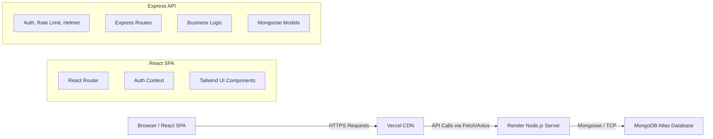

<div align="center">
  <h1>🚀 Startup CRM Lite</h1>
  <p><strong>A Lightweight, Production-Ready Customer Relationship Management System for Modern Startups</strong></p>

  
  
  
  
  
  
</div>

<br />

## 📖 Table of Contents

- [Project Overview](#-project-overview)
- [System Architecture](#-system-architecture)
- [Technology Stack](#-technology-stack)
- [Project Folder Structure](#-project-folder-structure)
- [Frontend Architecture](#-frontend-architecture)
- [Backend Architecture](#-backend-architecture)
- [Database Architecture](#-database-architecture)
- [Authentication & Authorization](#-authentication--authorization)
- [Development Guide](#-development-guide)
  - [Prerequisites](#prerequisites)
  - [Installation Guide](#installation-guide)
  - [Environment Variables](#environment-variables)
  - [Running the Project](#running-the-project)
- [Deployment Guide](#-deployment-guide)
- [Security Considerations](#-security-considerations)
- [Performance Optimizations](#-performance-optimizations)
- [Coding Standards & Conventions](#-coding-standards--conventions)
- [Future Roadmap](#-future-roadmap)
- [License & Credits](#-license--credits)

---

## 🌟 Project Overview

### Problem Statement
Startups and small businesses often find enterprise CRMs (like Salesforce or HubSpot) too complex, bloated, and expensive for their immediate needs. They require a streamlined, fast, and easy-to-use tool to track leads, manage contacts, and analyze sales performance without a steep learning curve.

### Vision & Objectives
**Startup CRM Lite** is engineered to bridge this gap. It provides a foundational, highly-performant CRM application that is easy to deploy, simple to maintain, and ready to scale. The objective is to offer a clean UI combined with a secure, RESTful backend, focusing strictly on what matters: lead management and basic analytics.

### Key Features
- **Lead Management:** Create, read, update, and track leads through different pipeline stages.
- **Interactive Dashboard:** View high-level metrics, recent activities, and pipeline health via Recharts.
- **Secure Authentication:** JWT-based user authentication with bcrypt password hashing.
- **Responsive UI:** A fully responsive, modern interface built with Tailwind CSS and React Router.
- **API Security:** Rate limiting, MongoDB injection sanitization, and Helmet for secure HTTP headers.

### Target Users & Use Cases
- **Founders & Indie Hackers:** Quick tracking of early adopters and beta testers.
- **Sales Teams (1-5 members):** Shared pipeline visibility without excessive overhead.
- **Freelancers:** Managing client relationships and project leads.

---

## 🏗 System Architecture

### High-Level Architecture Overview

The system follows a standard **MERN** (MongoDB, Express, React, Node.js) stack topology, physically separated into a static frontend application and a dynamic REST API backend.



### Application Workflow
1. **Authentication:** User logs in via the React frontend. The backend validates credentials and returns an HTTP-only/Bearer JWT.
2. **State Management:** The frontend `AuthContext` stores the session state and guards protected routes.
3. **Data Fetching:** The user accesses the Dashboard or Leads page. Axios sends an authenticated request to the Express API.
4. **Data Processing:** Express routes the request to the specific Controller, which queries MongoDB via Mongoose.
5. **Response Rendering:** JSON data is returned to the frontend, which renders dynamic tables and charts.

---

## 🛠 Technology Stack

### Frontend
- **Framework:** React 19 (Vite)
- **Routing:** React Router v7
- **Styling:** Tailwind CSS v4
- **Icons:** Lucide React
- **Data Visualization:** Recharts
- **HTTP Client:** Axios
- **Notifications:** React Hot Toast

### Backend
- **Runtime:** Node.js 18+
- **Framework:** Express.js 4
- **Database ORM:** Mongoose 9
- **Security:** Helmet, Express Rate Limit, Express Mongo Sanitize
- **Authentication:** JSON Web Tokens (JWT), bcryptjs
- **Logging:** Morgan

### Infrastructure & Deployment
- **Frontend Hosting:** Vercel (`vercel.json`)
- **Backend Hosting:** Render (`render.yaml`)
- **Database:** MongoDB Atlas

---

## 📂 Project Folder Structure

```text
startup-crm-lite/
├── backend/                  # Node.js / Express Backend
│   ├── config/               # Database and environment configurations
│   ├── controllers/          # Business logic for routes
│   ├── middleware/           # Custom Express middlewares (Auth, Error Handler)
│   ├── models/               # Mongoose schemas (User.js, Lead.js)
│   ├── routes/               # API route definitions
│   ├── utils/                # Helper functions
│   ├── package.json          # Backend dependencies
│   └── server.js             # Express application entry point
├── src/                      # React Frontend Source
│   ├── assets/               # Static images and icons
│   ├── components/           # Reusable UI components
│   │   ├── analytics/        # Chart and metric components
│   │   ├── common/           # Buttons, inputs, modals
│   │   ├── dashboard/        # Dashboard specific widgets
│   │   └── leads/            # Lead tables and forms
│   ├── constants/            # Application-wide constants
│   ├── context/              # React Context (AuthContext)
│   ├── data/                 # Mock data or static data maps
│   ├── hooks/                # Custom React hooks
│   ├── pages/                # Top-level route components (Dashboard, Leads, Auth)
│   ├── routes/               # Routing configuration
│   ├── services/             # Axios API services
│   ├── utils/                # Frontend helper functions
│   ├── App.jsx               # Main React application component
│   └── main.jsx              # React DOM mounting point
├── public/                   # Public static assets
├── .env                      # Root environment variables (Development)
├── package.json              # Root package (Monorepo scripts)
├── render.yaml               # Infrastructure as Code for Render deployment
├── vercel.json               # SPA routing configuration for Vercel
└── vite.config.js            # Vite build tool configuration
```

### Explanation of Major Folders
- **`backend/controllers/`**: Keeps `server.js` clean by isolating the actual logic executed when an API endpoint is hit.
- **`backend/models/`**: Defines the NoSQL database schema using Mongoose, establishing the structure for Users and Leads.
- **`src/context/`**: Manages global frontend state without the overhead of Redux. Specifically used for handling the authenticated user session.
- **`src/services/`**: Centralizes all external API calls. If the backend URL changes, it only needs to be updated here.

---

## 🏗 Architecture Deep Dive

### Frontend Architecture
The frontend is a Single Page Application (SPA) built with React and bundled via Vite for extreme speed.
- **Component-Driven:** UIs are broken down into granular, reusable pieces inside `src/components`.
- **Protected Routing:** `React Router` works in tandem with `AuthContext` in `App.jsx` to ensure unauthenticated users are redirected to `/login`.
- **CSS Utility-First:** Tailwind CSS is used globally, configured via `@tailwindcss/vite`, ensuring zero dead CSS in production.

### Backend Architecture
The backend uses a traditional Model-View-Controller (MVC) pattern adapted for APIs (Model-Route-Controller).
- **Server Bootstrap:** `server.js` initializes middleware, connects to MongoDB, and binds routes.
- **Security-First:** Global middlewares (Helmet, CORS, Rate Limiting, Mongo Sanitize) intercept requests before they hit application logic to prevent common attack vectors.
- **Error Handling:** A centralized error handling middleware catches unhandled promise rejections and formats them into a standardized JSON response.

### Database Architecture
MongoDB is utilized as the persistent data store.
- **`User` Collection:** Stores user credentials. Passwords are salted and hashed via `bcrypt` before saving.
- **`Lead` Collection:** Stores customer information (Name, Email, Status, Value).
- **Relationships:** While currently flat, Leads can be tied to User ObjectIDs for multi-tenant scalability in the future.

---

## 🔐 Authentication & Authorization

1. **Registration:** User submits email/password. Backend hashes the password and stores the User document.
2. **Login:** Backend verifies the hash. Upon success, it signs a JWT using `JWT_SECRET`.
3. **Session:** The JWT is returned to the client and stored (typically in Memory/Context or LocalStorage).
4. **Authorization:** The client includes the JWT in the `Authorization: Bearer <token>` header for subsequent requests. The backend `authMiddleware` decodes the token; if valid, the request proceeds to the controller.

---

## 🚀 Development Guide

### Prerequisites
- [Node.js](https://nodejs.org/) (v18 or higher)
- [MongoDB](https://www.mongodb.com/) (Local instance or MongoDB Atlas cluster)
- Git

### Installation Guide
1. **Clone the repository:**
   ```bash
   git clone https://github.com/your-username/startup-crm-lite.git
   cd startup-crm-lite
   ```

2. **Install Root Dependencies:**
   ```bash
   npm install
   ```

3. **Install Backend Dependencies:**
   ```bash
   cd backend
   npm install
   cd ..
   ```

### Environment Variables
You must create `.env` files in both the root directory and the `backend/` directory.

**Root `.env` (Frontend):**
```env
VITE_API_URL=http://localhost:5000/api
```

**Backend `.env` (`backend/.env`):**
```env
PORT=5000
NODE_ENV=development
MONGODB_URI=mongodb+srv://<user>:<password>@cluster.mongodb.net/startup-crm
JWT_SECRET=your_super_secret_jwt_string_change_in_production
FRONTEND_URL=http://localhost:5173
```

### Running the Project

The project is equipped with `concurrently` to run both frontend and backend from the root directory.

**Development Mode:**
```bash
# From the root directory
npm run dev:full
```
- Frontend runs on `http://localhost:5173`
- Backend API runs on `http://localhost:5000`

---

## 🌍 Deployment Guide

### Backend Deployment (Render)
The project includes a `render.yaml` file for continuous deployment on Render.
1. Connect your GitHub repository to Render.
2. Render will automatically detect the `render.yaml` blueprint.
3. Ensure you manually provide `MONGODB_URI`, `JWT_SECRET`, and `FRONTEND_URL` in the Render dashboard environment settings, as they are marked `sync: false` in the blueprint for security.

### Frontend Deployment (Vercel)
The project includes a `vercel.json` to handle SPA routing rewrites.
1. Import the repository into Vercel.
2. Vercel will automatically detect the Vite React project.
3. Add the `VITE_API_URL` environment variable pointing to your deployed Render backend URL.
4. Deploy.

---

## 🛡 Security Considerations
- **NoSQL Injection:** Mitigated using `express-mongo-sanitize`.
- **XSS & Sniffing:** Mitigated by setting HTTP headers via `helmet`.
- **Brute Force Attacks:** Mitigated using `express-rate-limit` on the `/api/auth/` routes.
- **Data Exposure:** Centralized error handler ensures stack traces are never leaked in the `production` environment.

---

## ⚡ Performance Optimizations
- **Vite Bundler:** Replaces Webpack, providing near-instant Hot Module Replacement (HMR) and highly optimized production builds using Rollup.
- **Payload Limits:** Express body parser is limited to `10kb` to prevent memory exhaustion attacks.
- **Index Optimization:** MongoDB schemas should be indexed on frequently queried fields (e.g., Lead emails, Status).

---

## 📖 Coding Standards & Conventions
- **ES Modules:** Both frontend and backend use ES Modules (`import`/`export`). Do not use `require()`.
- **Linting:** Configured via `eslint.config.js`. Run `npm run lint` before committing.
- **Branching Strategy:** 
  - `main` - Production ready.
  - `dev` - Active development.
  - `feature/*` - New features (e.g., `feature/analytics-dashboard`).

---

## 🔮 Future Roadmap
- [ ] **Multi-tenancy:** Allow different companies to have isolated CRM workspaces.
- [ ] **Email Integration:** Send and track emails directly from the lead view via SendGrid or AWS SES.
- [ ] **Data Export:** Export leads to CSV/Excel.
- [ ] **Role-Based Access Control (RBAC):** Admin vs Standard user roles.

---

## 📄 License & Credits

**License:** [ISC](https://opensource.org/licenses/ISC)
This project is open-source and free to use. 

*Designed and engineered to simplify customer relationship management for the next generation of startups.*
